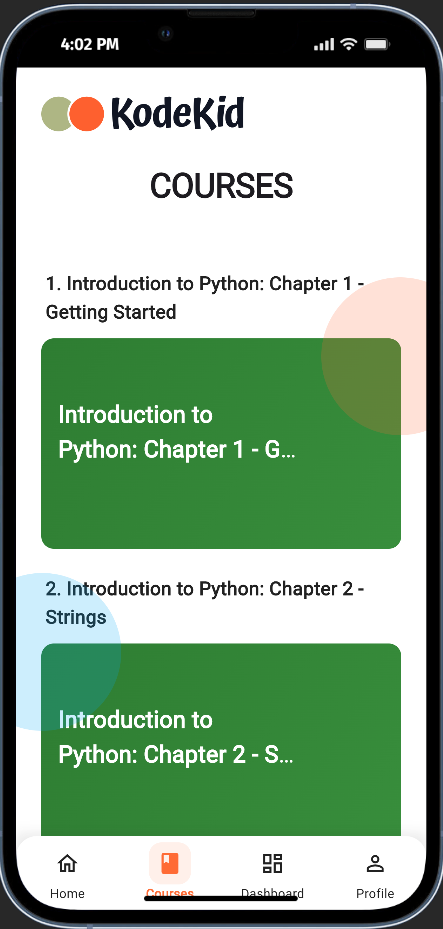
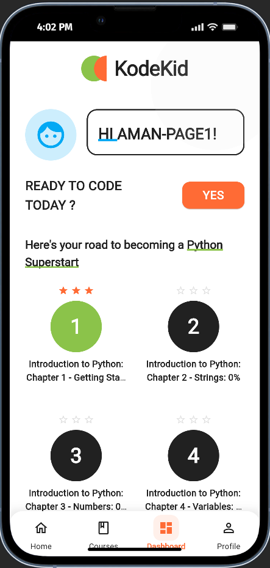
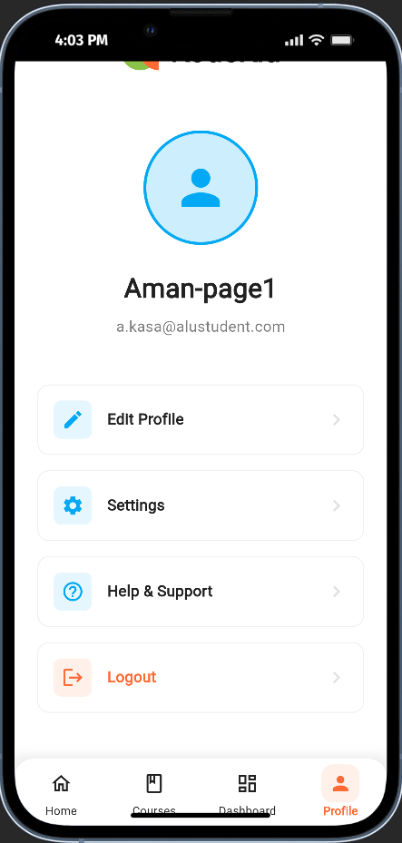

<div align="center">

# 🚀 KodeKid: Interactive Python Tutor For Kids


**An interactive learning platform designed to introduce children aged 8-12 to programming using Python through fun, gamification, and safe coding practices.**

[🎮 Live Demo](https://kodekid-demo.web.app) • [📱 Download APK](https://github.com/NzizaPacifique250/kodekid_MD/releases) • [🎨 Figma Design](https://www.figma.com/design/Ak1Nv1utUzyToWtE32JQBY/KodeKid---Kids-Learning-App--Copy-?node-id=0-1&p=f&t=gxIEbfEqq61KB3hp-0)

<br>

## 📱 App Preview

<div align="center">

### 🏠 Home Page


### 📚 Courses


### 📊 Dashboard


### 👤 Profile


<em>✨ Complete app navigation showcasing all main features</em>

</div>

</div>

---

## ✨ Features

<div align="center">

| 🎯 **Interactive Lessons** | 🏆 **Gamification** | ⚡ **Instant Feedback** |
|:---:|:---:|:---:|
| Kids learn by coding directly in the browser | Earn badges and complete challenges | Immediate visual feedback on code execution |

| 🔒 **Safe Environment** | 📊 **Progress Tracking** | 🎨 **Child-Friendly UI** |
|:---:|:---:|:---:|
| Sandbox ensures kids can code safely | Monitor lesson completions and achievements | Bright, playful, and intuitive interface |

</div>

---

## 🎯 Purpose

**KodeKid** addresses the lack of engaging coding tools for young beginners and encourages:
- 🧠 **Creativity** and problem-solving skills
- 💪 **Confidence** in coding
- 🎮 **Fun learning** through interactive experiences
- 🔐 **Safe** programming environment for children

---

## 🛠️ Technology Stack

<div align="center">

| **Frontend** | **Backend** | **State Management** | **Design** |
|:---:|:---:|:---:|:---:|
|  |  |  |  |
| Mobile & Web | Auth, Firestore, Storage | Modern State Management | Interactive & Colorful UI |

</div>

**Additional Technologies:**
- 🐍 **Python Execution:** Safe sandbox environment
- 📱 **Cross-Platform:** Works on mobile and web
- 🎥 **Video Integration:** YouTube player for lessons
- 💾 **Local Storage:** SharedPreferences for settings

---

## 👥 Meet Our Amazing Team

<div align="center">

<table>
<tr>
<td align="center">
<a href="https://github.com/Aman-Kasa">
<br />
<sub><b>🚀 Aman</b></sub><br />
<sub>Frontend Developer</sub>
</a>
</td>
<td align="center">
<a href="https://github.com/NzizaPacifique250">
<br />
<sub><b>🌊 Pacific</b></sub><br />
<sub>Project Lead</sub>
</a>
</td>
<td align="center">
<a href="https://github.com/aimable0">
<br />
<sub><b>🎯 Aimable</b></sub><br />
<sub>Backend Developer</sub>
</a>
</td>
<td align="center">
<a href="https://github.com/Yvantrey">
<br />
<sub><b>⚡ Yvan</b></sub><br />
<sub>UI/UX Designer</sub>
</a>
</td>
<td align="center">
<a href="https://github.com/Millowise01">
<br />
<sub><b>🧠 Millowise</b></sub><br />
<sub>Full Stack Developer</sub>
</a>
</td>
</tr>
</table>

</div>

---

## 📁 Project Architecture

<div align="center">

```
📦 KodeKid
├── 📱 lib/                          # Main Flutter application
│   ├── 🚀 main.dart                 # App entry point
│   ├── 🎯 features/                 # Feature modules
│   │   ├── 📚 lessons/              # Interactive Python lessons
│   │   ├── ✏️ code_editor/          # Safe code editor
│   │   ├── 👤 user_profile/         # Profile & progress tracking
│   │   ├── 🏆 gamification/         # Badges & achievements
│   │   └── 🏠 dashboard/            # Main dashboard
│   ├── 🔧 core/                     # Core utilities
│   │   ├── 🎨 constants/            # Colors, styles, constants
│   │   ├── 🛠️ utils/                # Helper functions
│   │   ├── 🧩 widgets/              # Reusable components
│   │   └── 🔄 providers/            # State management
│   └── 🗺️ routes/                   # Navigation & routing
├── 🎨 assets/                       # Static assets
│   ├── 🖼️ images/                   # UI images & icons
│   └── 🔤 fonts/                    # Custom fonts
└── 🔥 Firebase Configuration        # Backend setup
```

</div>

---

## 🚀 Getting Started

### Prerequisites
- 📱 Flutter SDK (3.6.1+)
- 🔥 Firebase account
- 🐍 Python environment (for backend)

### Installation

```bash
# 1️⃣ Clone the repository
git clone https://github.com/NzizaPacifique250/kodekid_MD.git
cd kodekid_MD

# 2️⃣ Install dependencies
flutter pub get

# 3️⃣ Configure Firebase
# Update firebase_options.dart with your config

# 4️⃣ Run the app
flutter run
```

### 🌐 Platform Support
- ✅ **Web:** Chrome, Firefox, Safari
- ✅ **Mobile:** Android, iOS
- ✅ **Desktop:** Windows, macOS, Linux

---

## 🎮 Key Features Implemented

<div align="center">

| Feature | Status | Description |
|---------|--------|-------------|
| 🔐 **Authentication** | ✅ | Firebase Auth with email verification |
| 📚 **Interactive Lessons** | ✅ | 6 Python chapters with video content |
| ✏️ **Code Editor** | ✅ | Safe sandbox environment for coding |
| 🏆 **Progress Tracking** | ✅ | Real-time progress with star system |
| 👤 **Profile Management** | ✅ | Riverpod state management |
| ⚙️ **Settings Persistence** | ✅ | SharedPreferences integration |
| 🎥 **Video Player** | ✅ | Cross-platform YouTube integration |
| 📱 **Responsive Design** | ✅ | Works on all screen sizes |

</div>

---

## 🏗️ Technical Highlights

### 🔄 State Management
- **Riverpod** for reactive state management
- **SharedPreferences** for local data persistence
- **Firebase** for real-time data synchronization

### 🎨 UI/UX Features
- Child-friendly colorful interface
- Smooth animations and transitions
- Responsive design for all devices
- Dark/Light theme support

### 🔒 Security & Safety
- Sandboxed code execution environment
- Firebase security rules
- Input validation and sanitization
- Safe external link handling

---

## 📊 Project Statistics

<div align="center">


</div>

---

## 🤝 Contributing

We welcome contributions! Here's how you can help:

1. 🍴 **Fork** the repository
2. 🌿 **Create** a feature branch (`git checkout -b feature/amazing-feature`)
3. 💾 **Commit** your changes (`git commit -m 'Add amazing feature'`)
4. 📤 **Push** to the branch (`git push origin feature/amazing-feature`)
5. 🔄 **Open** a Pull Request

### 📋 Contribution Guidelines
- Follow Flutter/Dart coding standards
- Write clear commit messages
- Add tests for new features
- Update documentation as needed

---

## 📄 License

This project is licensed under the **MIT License** - see the [LICENSE](LICENSE) file for details.

---

<div align="center">

## 🌟 Show Your Support

If you like this project, please ⭐ **star** this repository!

**Made with ❤️ by the KodeKid Team**

[🐛 Report Bug](https://github.com/NzizaPacifique250/kodekid_MD/issues) • [✨ Request Feature](https://github.com/NzizaPacifique250/kodekid_MD/issues) • [💬 Discussions](https://github.com/NzizaPacifique250/kodekid_MD/discussions)

</div>